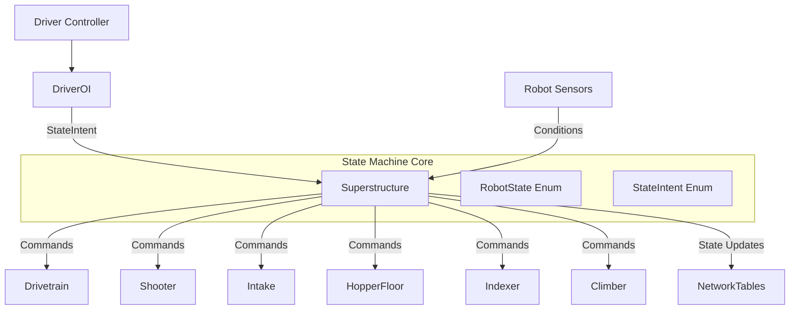
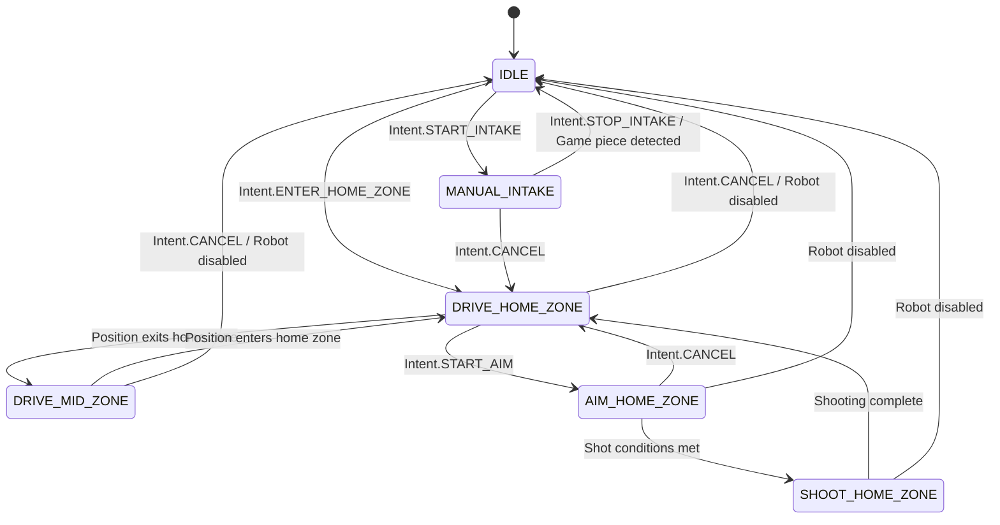
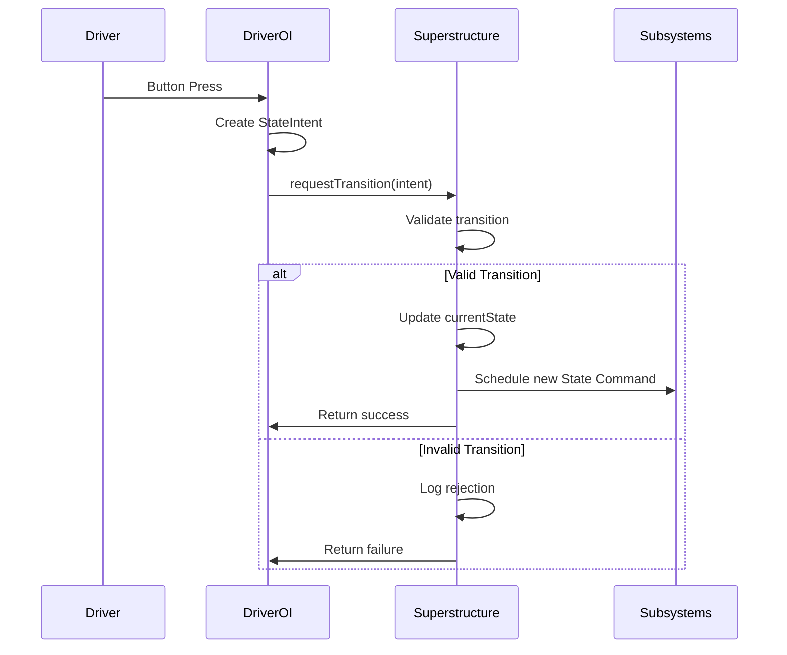

# Design Document: Robot State Machine Architecture

## Overview

This design implements a centralized state machine architecture for an FRC robot using the Command-based programming paradigm. The Superstructure subsystem acts as the central orchestrator, managing robot states and coordinating subsystem actions. Driver inputs are translated into StateIntents by DriverOI, which Superstructure evaluates to determine valid state transitions.

The architecture follows these key principles:
- **Single Source of Truth**: Superstructure maintains the authoritative currentState
- **Intent-Based Control**: Driver inputs express intent, not direct state changes
- **Validation First**: All transitions are validated before execution
- **Command Composition**: States are implemented as Commands that can coordinate multiple subsystems
- **Fail-Safe Design**: Invalid transitions are rejected, and a safe default state is always available

## Architecture

### Component Diagram



### State Transition Diagram



### Data Flow



## Components and Interfaces

### StateIntent Enum

```java
public enum StateIntent {
    // Driver-initiated intents
    START_INTAKE,           // Request to begin manual intake
    STOP_INTAKE,            // Request to stop intake
    START_AIM,              // Request to aim at target
    START_SHOOT,            // Request to shoot (after aiming)
    CANCEL,                 // Cancel current operation, return to driving
    
    // Mode toggles
    TOGGLE_DRIVE_MODE,      // Toggle between field-oriented and robot-oriented
    
    // Zone navigation
    ENTER_HOME_ZONE,        // Explicitly enter home zone mode
    ENTER_MID_ZONE,         // Explicitly enter mid zone mode
    
    // Safety
    EMERGENCY_STOP,         // Immediate stop all operations
    RETURN_TO_IDLE          // Return to safe idle state
}
```

### RobotState Enum

```java
public enum RobotState {
    IDLE,                   // Safe default: all mechanisms stopped
    DRIVE_HOME_ZONE,        // Driving in home zone (near alliance wall)
    DRIVE_MID_ZONE,         // Driving in mid-field zone
    AIM_HOME_ZONE,          // Aiming shooter from home zone
    SHOOT_HOME_ZONE,        // Actively shooting from home zone
    MANUAL_INTAKE,          // Manually intaking game pieces
    CLIMB_PREP,             // Preparing for end-game climb
    CLIMBING                // Actively climbing
}
```

### Superstructure Class Structure

```java
public class Superstructure extends SubsystemBase {
    // State management
    private RobotState currentState;
    private RobotState previousState;
    private final List<Trigger> stateTriggers;
    private final Map<RobotState, Runnable> transitionFunctions;
    private final Map<RobotState, Command> stateCommands;
    
    // Subsystem references
    private final RobotContainer container;
    private final CommandSwerveDrivetrain drivetrain;
    private final Shooter shooter;
    private final Intake intake;
    private final HopperFloor hopperFloor;
    private final Indexer indexer;
    
    // Logging and diagnostics
    private final CircularBuffer<StateTransition> transitionHistory;
    private double lastPeriodicTime;
    
    // Constructor
    public Superstructure(RobotContainer container);
    
    // Public API
    public Command requestTransition(StateIntent intent);
    public RobotState getCurrentState();
    public boolean isValidTransition(RobotState from, RobotState to);
    
    // State command factories
    private Command idleCommand();
    private Command driveHomeZoneCommand();
    private Command driveMidZoneCommand();
    private Command aimHomeZoneCommand();
    private Command shootHomeZoneCommand();
    private Command manualIntakeCommand();
    
    // Transition validation
    private boolean canTransitionTo(RobotState target, StateIntent intent);
    private void executeTransition(RobotState newState, String reason);
    
    // Transition functions (called in periodic)
    private void checkIdleTransitions();
    private void checkDriveHomeZoneTransitions();
    private void checkDriveMidZoneTransitions();
    private void checkAimHomeZoneTransitions();
    private void checkShootHomeZoneTransitions();
    private void checkManualIntakeTransitions();
    
    // Utility methods
    private boolean isInHomeZone();
    private boolean isInMidZone();
    private boolean areShotConditionsMet();
    private boolean hasGamePiece();
    
    @Override
    public void periodic();
}
```

### DriverOI Class Structure

```java
public class DriverOI extends BaseOI {
    // Superstructure reference
    private final Superstructure superstructure;
    
    // Input suppliers
    public final Supplier<Double> driveAxial;
    public final Supplier<Double> driveLateral;
    public final Supplier<Double> driveFORX;
    public final Supplier<Double> driveFORY;
    
    // Triggers
    public final Trigger manualRotation;
    public final Trigger intake;
    public final Trigger startShoot;
    public final Trigger shotConditionsMet;
    public final Trigger toggleDriveMode;
    public final Trigger lockWheels;
    public final Trigger resetFOD;
    public final Trigger resetAngle;
    
    // Constructor
    public DriverOI(CommandXboxController controller, Superstructure superstructure);
    
    // Configuration
    public void configureControls(RobotContainer container);
    
    // Helper methods
    private Command submitIntent(StateIntent intent);
}
```

### RobotContainer Integration

```java
public class RobotContainer {
    // Subsystems (created first)
    public final CommandSwerveDrivetrain drivetrain;
    public final Shooter shooter;
    public final Intake intake;
    public final HopperFloor hopperFloor;
    public final Indexer indexer;
    
    // State machine (created after subsystems)
    public final Superstructure superstructure;
    
    // Operator interfaces (created after superstructure)
    public final DriverOI driverOI;
    public final OperatorOI operatorOI;
    
    public RobotContainer() {
        // 1. Create all subsystems
        this.drivetrain = TunerConstants.createDrivetrain();
        this.shooter = new Shooter();
        this.intake = new Intake();
        this.hopperFloor = new HopperFloor();
        this.indexer = new Indexer();
        
        // 2. Create superstructure with subsystem references
        this.superstructure = new Superstructure(this);
        
        // 3. Create operator interfaces with superstructure reference
        this.driverOI = new DriverOI(joystick1, superstructure);
        this.operatorOI = new OperatorOI(joystick2);
        
        // 4. Configure bindings
        configureBindings();
    }
    
    private void configureBindings() {
        // Let DriverOI configure its own bindings
        this.driverOI.configureControls(this);
        
        // Configure drivetrain default command
        drivetrain.setDefaultCommand(drivetrain.joystickDrive(driverOI));
        
        // Other non-state-machine bindings
        // ...
    }
}
```

## Data Models

### StateTransition Record

```java
public record StateTransition(
    RobotState fromState,
    RobotState toState,
    String reason,
    double timestamp,
    boolean wasAutomatic
) {
    public String toString() {
        return String.format("[%.2f] %s -> %s (%s)%s",
            timestamp,
            fromState,
            toState,
            reason,
            wasAutomatic ? " [AUTO]" : ""
        );
    }
}
```

### Transition Validation Result

```java
public class TransitionResult {
    private final boolean valid;
    private final String reason;
    
    public static TransitionResult valid() {
        return new TransitionResult(true, "");
    }
    
    public static TransitionResult invalid(String reason) {
        return new TransitionResult(false, reason);
    }
    
    public boolean isValid() { return valid; }
    public String getReason() { return reason; }
}
```

## Implementation Details

### Superstructure Constructor Implementation

The constructor must initialize all data structures before use to avoid NullPointerException:

```java
public Superstructure(RobotContainer container) {
    this.container = container;
    this.drivetrain = container.drivetrain;
    this.shooter = container.shooter;
    this.intake = container.intake;
    this.hopperFloor = container.hopperFloor;
    this.indexer = container.indexer;
    
    // Initialize collections BEFORE use
    this.stateTriggers = new ArrayList<>();
    this.transitionFunctions = new HashMap<>();
    this.stateCommands = new HashMap<>();
    this.transitionHistory = new CircularBuffer<>(50);
    
    // Set initial state
    this.currentState = RobotState.IDLE;
    this.previousState = RobotState.IDLE;
    
    // Initialize state commands
    initializeStateCommands();
    
    // Initialize state triggers
    initializeStateTriggers();
    
    // Register transition functions
    registerTransitionFunctions();
    
    // Log initialization
    Logger.recordOutput("Superstructure/Initialized", true);
    Logger.recordOutput("Superstructure/CurrentState", currentState.toString());
}
```

### State Command Initialization

```java
private void initializeStateCommands() {
    stateCommands.put(RobotState.IDLE, idleCommand());
    stateCommands.put(RobotState.DRIVE_HOME_ZONE, driveHomeZoneCommand());
    stateCommands.put(RobotState.DRIVE_MID_ZONE, driveMidZoneCommand());
    stateCommands.put(RobotState.AIM_HOME_ZONE, aimHomeZoneCommand());
    stateCommands.put(RobotState.SHOOT_HOME_ZONE, shootHomeZoneCommand());
    stateCommands.put(RobotState.MANUAL_INTAKE, manualIntakeCommand());
}

private void initializeStateTriggers() {
    for (RobotState state : RobotState.values()) {
        Command stateCommand = stateCommands.get(state);
        if (stateCommand != null) {
            Trigger stateTrigger = new Trigger(() -> this.currentState == state)
                .whileTrue(stateCommand);
            stateTriggers.add(stateTrigger);
        } else {
            Logger.recordOutput("Superstructure/Warning", 
                "No command defined for state: " + state);
        }
    }
}
```

### StateIntent Handling

```java
public Command requestTransition(StateIntent intent) {
    return new InstantCommand(() -> {
        Logger.recordOutput("Superstructure/IntentReceived", intent.toString());
        
        RobotState targetState = mapIntentToState(intent);
        if (targetState == null) {
            Logger.recordOutput("Superstructure/IntentRejected", 
                "No state mapping for intent: " + intent);
            return;
        }
        
        TransitionResult result = validateTransition(currentState, targetState, intent);
        if (result.isValid()) {
            executeTransition(targetState, "Intent: " + intent);
        } else {
            Logger.recordOutput("Superstructure/TransitionRejected", 
                String.format("%s -> %s: %s", currentState, targetState, result.getReason()));
        }
    });
}

private RobotState mapIntentToState(StateIntent intent) {
    return switch (intent) {
        case START_INTAKE -> RobotState.MANUAL_INTAKE;
        case START_AIM -> RobotState.AIM_HOME_ZONE;
        case CANCEL, RETURN_TO_IDLE, EMERGENCY_STOP -> RobotState.IDLE;
        case ENTER_HOME_ZONE -> RobotState.DRIVE_HOME_ZONE;
        case ENTER_MID_ZONE -> RobotState.DRIVE_MID_ZONE;
        case TOGGLE_DRIVE_MODE -> null; // Handled differently
        default -> null;
    };
}
```

### Transition Validation

```java
private TransitionResult validateTransition(RobotState from, RobotState to, StateIntent intent) {
    // Always allow transition to IDLE
    if (to == RobotState.IDLE) {
        return TransitionResult.valid();
    }
    
    // Check state-specific validation rules
    return switch (from) {
        case IDLE -> validateFromIdle(to, intent);
        case DRIVE_HOME_ZONE -> validateFromDriveHomeZone(to, intent);
        case DRIVE_MID_ZONE -> validateFromDriveMidZone(to, intent);
        case AIM_HOME_ZONE -> validateFromAimHomeZone(to, intent);
        case SHOOT_HOME_ZONE -> validateFromShootHomeZone(to, intent);
        case MANUAL_INTAKE -> validateFromManualIntake(to, intent);
        default -> TransitionResult.invalid("Unknown source state: " + from);
    };
}

private TransitionResult validateFromIdle(RobotState to, StateIntent intent) {
    return switch (to) {
        case DRIVE_HOME_ZONE, DRIVE_MID_ZONE -> TransitionResult.valid();
        case MANUAL_INTAKE -> intake.checkExtended() 
            ? TransitionResult.valid()
            : TransitionResult.invalid("Intake not ready");
        case AIM_HOME_ZONE -> isInHomeZone()
            ? TransitionResult.valid()
            : TransitionResult.invalid("Not in home zone");
        default -> TransitionResult.invalid("Invalid transition from IDLE to " + to);
    };
}

// Similar validation methods for other states...
```

### Transition Execution

```java
private void executeTransition(RobotState newState, String reason) {
    if (newState == currentState) {
        return; // No-op if already in target state
    }
    
    // Record transition
    StateTransition transition = new StateTransition(
        currentState,
        newState,
        reason,
        Timer.getFPGATimestamp(),
        !reason.startsWith("Intent:")
    );
    transitionHistory.addLast(transition);
    
    // Update state
    previousState = currentState;
    currentState = newState;
    
    // Log transition
    Logger.recordOutput("Superstructure/CurrentState", currentState.toString());
    Logger.recordOutput("Superstructure/PreviousState", previousState.toString());
    Logger.recordOutput("Superstructure/TransitionReason", reason);
    Logger.recordOutput("Superstructure/LastTransition", transition.toString());
    
    System.out.println("State transition: " + transition);
}
```

### Periodic Method

```java
@Override
public void periodic() {
    double startTime = Timer.getFPGATimestamp();
    
    // Execute transition function for current state
    Runnable transitionFunction = transitionFunctions.get(currentState);
    if (transitionFunction != null) {
        transitionFunction.run();
    } else {
        Logger.recordOutput("Superstructure/Warning",
            "No transition function for state: " + currentState);
    }
    
    // Log execution time
    double executionTime = Timer.getFPGATimestamp() - startTime;
    lastPeriodicTime = executionTime;
    Logger.recordOutput("Superstructure/PeriodicTime", executionTime);
    
    // Warn if periodic is taking too long
    if (executionTime > 0.020) { // 20ms
        Logger.recordOutput("Superstructure/PeriodicOverrun", executionTime);
    }
}
```

### Transition Functions

```java
private void registerTransitionFunctions() {
    transitionFunctions.put(RobotState.IDLE, this::checkIdleTransitions);
    transitionFunctions.put(RobotState.DRIVE_HOME_ZONE, this::checkDriveHomeZoneTransitions);
    transitionFunctions.put(RobotState.DRIVE_MID_ZONE, this::checkDriveMidZoneTransitions);
    transitionFunctions.put(RobotState.AIM_HOME_ZONE, this::checkAimHomeZoneTransitions);
    transitionFunctions.put(RobotState.SHOOT_HOME_ZONE, this::checkShootHomeZoneTransitions);
    transitionFunctions.put(RobotState.MANUAL_INTAKE, this::checkManualIntakeTransitions);
}

private void checkDriveHomeZoneTransitions() {
    // Automatic transition to mid zone if robot leaves home zone
    if (!isInHomeZone() && isInMidZone()) {
        executeTransition(RobotState.DRIVE_MID_ZONE, "Automatic: Left home zone");
    }
}

private void checkDriveMidZoneTransitions() {
    // Automatic transition to home zone if robot enters home zone
    if (isInHomeZone()) {
        executeTransition(RobotState.DRIVE_HOME_ZONE, "Automatic: Entered home zone");
    }
}

private void checkAimHomeZoneTransitions() {
    // Automatic transition to shooting when conditions are met
    if (areShotConditionsMet()) {
        executeTransition(RobotState.SHOOT_HOME_ZONE, "Automatic: Shot conditions met");
    }
}

private void checkShootHomeZoneTransitions() {
    // Transition back to driving after shooting completes
    // This would check if the shooter has finished its cycle
    if (!shooter.isShooting() && !hopperFloor.isRunning()) {
        executeTransition(RobotState.DRIVE_HOME_ZONE, "Automatic: Shooting complete");
    }
}

private void checkManualIntakeTransitions() {
    // Automatic transition when game piece is detected
    if (hasGamePiece()) {
        executeTransition(RobotState.IDLE, "Automatic: Game piece acquired");
    }
}
```

### DriverOI Implementation

```java
public DriverOI(CommandXboxController controller, Superstructure superstructure) {
    super(controller);
    
    this.superstructure = superstructure;
    
    // Initialize input suppliers
    this.driveAxial = controller::getLeftY;
    this.driveLateral = controller::getLeftX;
    
    if (Constants.mode == Mode.REAL) {
        this.driveFORX = controller::getRightX;
        this.driveFORY = () -> -controller.getRightY();
    } else {
        this.driveFORX = () -> this.hid.getRawAxis(2);
        this.driveFORY = () -> this.hid.getRawAxis(3);
    }
    
    // Initialize triggers
    this.manualRotation = controller.rightStick();
    this.intake = controller.b();
    this.startShoot = controller.leftTrigger();
    this.toggleDriveMode = controller.leftBumper();
    this.lockWheels = controller.x();
    this.resetFOD = controller.y();
    this.resetAngle = controller.a();
    
    // Shot conditions trigger
    this.shotConditionsMet = new Trigger(() -> {
        // TODO: Implement actual shot condition checking
        return true;
    });
}

public void configureControls(RobotContainer container) {
    // State machine intents
    this.intake.onTrue(superstructure.requestTransition(StateIntent.START_INTAKE));
    this.intake.onFalse(superstructure.requestTransition(StateIntent.STOP_INTAKE));
    this.startShoot.onTrue(superstructure.requestTransition(StateIntent.START_AIM));
    this.toggleDriveMode.onTrue(superstructure.requestTransition(StateIntent.TOGGLE_DRIVE_MODE));
    
    // Direct drivetrain commands (not managed by state machine)
    this.resetFOD.onTrue(new InstantCommand(container.drivetrain::resetAngle));
    this.resetAngle.whileTrue(new RunCommand(container.drivetrain::seedLimelightImu));
    this.resetAngle.whileFalse(new RunCommand(container.drivetrain::setImuMode2));
}
```


## Correctness Properties

A property is a characteristic or behavior that should hold true across all valid executions of a system—essentially, a formal statement about what the system should do. Properties serve as the bridge between human-readable specifications and machine-verifiable correctness guarantees.

### Property Reflection

After analyzing all acceptance criteria, I identified the following redundancies:
- Criteria 5.2 is redundant with 2.5 (both about scheduling commands on state activation)
- Criteria 9.2 is redundant with 3.1 (both about validating transitions)
- Criteria 9.3 is redundant with 3.3 (both about updating state on valid transitions)
- Criteria 10.1 is redundant with 2.3 (both about initialization to idle state)
- Criteria 11.2 is redundant with 9.6 (both about logging intent submissions)
- Criteria 11.3 is redundant with 3.2 (both about logging rejected transitions)

The following properties represent the unique, testable behaviors after eliminating redundancy:

### Property 1: State Command Scheduling on Transition

*For any* valid state transition, when the currentState changes to a new state, the State_Command associated with that new state should be scheduled for execution.

**Validates: Requirements 2.5**

### Property 2: Transition Validation Always Occurs

*For any* StateIntent received and any current state, the Superstructure should evaluate whether the transition is valid before making any state changes.

**Validates: Requirements 3.1**

### Property 3: Invalid Transitions Are Rejected

*For any* invalid state transition request, the Superstructure should reject the transition, keep the current state unchanged, and log a warning message.

**Validates: Requirements 3.2**

### Property 4: Valid Transitions Update State

*For any* valid state transition request, the Superstructure should update currentState to the new target state.

**Validates: Requirements 3.3**

### Property 5: Automatic Zone Transitions

*For any* robot position that crosses a zone boundary, the Superstructure should automatically transition to the appropriate zone state (DRIVE_HOME_ZONE or DRIVE_MID_ZONE).

**Validates: Requirements 4.1**

### Property 6: Automatic Intake Completion Transition

*For any* time the robot is in MANUAL_INTAKE state and a game piece is detected, the Superstructure should automatically transition to IDLE state.

**Validates: Requirements 4.2**

### Property 7: Automatic Shooting Transition

*For any* time the robot is in AIM_HOME_ZONE state and shot conditions are met, the Superstructure should automatically transition to SHOOT_HOME_ZONE state.

**Validates: Requirements 4.3**

### Property 8: Automatic Transitions Are Logged

*For any* automatic state transition (not triggered by StateIntent), the Superstructure should log the transition with timestamp, reason, and automatic flag set to true.

**Validates: Requirements 4.5**

### Property 9: State Command Cancellation on Exit

*For any* state transition, when leaving a state, the State_Command associated with the previous state should be cancelled before the new state's command is scheduled.

**Validates: Requirements 5.3**

### Property 10: Missing State Command Error Handling

*For any* RobotState that does not have an associated State_Command defined, the Superstructure should log an error during initialization and either use a safe default command or skip trigger creation for that state.

**Validates: Requirements 5.5**

### Property 11: Periodic Calls Transition Function

*For any* periodic() execution, the Superstructure should call the transition function corresponding to the currentState.

**Validates: Requirements 8.3**

### Property 12: Missing Transition Function Warning

*For any* RobotState that does not have a registered transition function, when that state becomes active and periodic() executes, the Superstructure should log a warning with the state name.

**Validates: Requirements 8.4**

### Property 13: Invalid Transition Returns Failure

*For any* invalid state transition request submitted via requestTransition(), the method should return a Command that, when executed, does not change the state and logs the rejection.

**Validates: Requirements 9.4**

### Property 14: StateIntent Submissions Are Logged

*For any* StateIntent submitted to Superstructure, the submission should be logged with the intent type, current state, and timestamp.

**Validates: Requirements 9.6**

### Property 15: Idle State Subsystem Safety

*For any* time the robot is in IDLE state, all motors should be stopped and all mechanisms should be in retracted or safe positions.

**Validates: Requirements 10.2**

### Property 16: Idle State Always Valid Target

*For any* current RobotState, a transition to IDLE state should always be validated as valid (IDLE is the universal safe state).

**Validates: Requirements 10.3**

### Property 17: State Transitions Are Logged

*For any* state transition that occurs, the Superstructure should log the previous state, new state, and trigger reason.

**Validates: Requirements 11.1**

### Property 18: Current State Logged to NetworkTables

*For any* periodic() execution, the Superstructure should log the currentState to NetworkTables.

**Validates: Requirements 11.4**

### Property 19: Transition History Buffer Maintenance

*For any* sequence of state transitions, the Superstructure should maintain a circular buffer containing the last 50 transitions, with older transitions being removed when the buffer is full.

**Validates: Requirements 11.5**

### Property 20: Periodic Execution Time Logging

*For any* periodic() execution, the Superstructure should log the execution time for performance monitoring.

**Validates: Requirements 11.6**

## Error Handling

### Initialization Errors

1. **Null Subsystem References**: If any subsystem reference passed to Superstructure is null, throw IllegalArgumentException with clear message indicating which subsystem is missing
2. **State Command Initialization Failure**: If a state command cannot be created, log error and register a safe idle command as fallback
3. **Trigger Creation Failure**: If trigger creation fails, log error but continue initialization for other states

### Runtime Errors

1. **Invalid StateIntent**: If an unknown StateIntent is received, log warning and ignore the request
2. **Transition Validation Exception**: If validation logic throws exception, catch it, log the error, reject the transition, and remain in current state
3. **Periodic Overrun**: If periodic() execution exceeds 20ms, log warning with execution time
4. **Missing Transition Function**: If no transition function exists for current state, log warning once per state entry and continue without automatic transitions

### Sensor Errors

1. **Position Sensor Failure**: If position sensors fail during zone detection, remain in current zone state and log error
2. **Game Piece Sensor Failure**: If intake sensor fails, do not automatically transition from MANUAL_INTAKE state
3. **Vision System Failure**: If vision system fails during aiming, reject transitions to AIM_HOME_ZONE state

### Recovery Strategies

1. **Emergency Stop**: StateIntent.EMERGENCY_STOP always transitions to IDLE regardless of validation
2. **Watchdog Timer**: If state machine appears stuck (no transitions for 30 seconds), log warning
3. **State Consistency Check**: On periodic(), verify currentState matches expected state based on subsystem status

## Testing Strategy

### Unit Testing Approach

Unit tests will focus on specific examples, edge cases, and initialization:

1. **Initialization Tests**:
   - Test that Superstructure initializes to IDLE state
   - Test that stateTriggers list is initialized before use
   - Test that all RobotStates have registered transition functions
   - Test that all RobotStates have associated State_Commands

2. **Edge Case Tests**:
   - Test transition to same state (should be no-op)
   - Test StateIntent with no state mapping (should be ignored)
   - Test robot disabled event triggers transition to IDLE
   - Test accessing uninitialized stateTriggers throws clear error

3. **Integration Tests**:
   - Test DriverOI button press creates correct StateIntent
   - Test StateIntent flows from DriverOI to Superstructure
   - Test state command actually schedules when state changes
   - Test multiple rapid StateIntent submissions

### Property-Based Testing Approach

Property tests will verify universal behaviors across all inputs using a Java property-based testing library (e.g., jqwik or QuickCheck for Java). Each test will run a minimum of 100 iterations.

1. **State Transition Properties**:
   - Generate random valid state transitions and verify state updates correctly
   - Generate random invalid state transitions and verify rejection
   - Generate random sequences of transitions and verify history buffer maintains last 50

2. **Logging Properties**:
   - Generate random state transitions and verify all are logged
   - Generate random StateIntents and verify all submissions are logged
   - Generate random periodic() calls and verify execution time is logged

3. **Automatic Transition Properties**:
   - Generate random robot positions and verify zone transitions occur correctly
   - Generate random sensor states and verify automatic transitions trigger appropriately

4. **Validation Properties**:
   - Generate random (state, intent) pairs and verify validation always occurs
   - Generate all possible transitions to IDLE and verify all are valid

### Property Test Configuration

Each property test will be tagged with a comment referencing its design property:

```java
@Property
// Feature: robot-state-machine, Property 1: State Command Scheduling on Transition
void stateCommandScheduledOnTransition(@ForAll RobotState fromState, @ForAll RobotState toState) {
    // Test implementation
}
```

### Test Coverage Goals

- **Unit Tests**: Cover all edge cases, initialization sequences, and error conditions
- **Property Tests**: Cover all universal properties (20 properties identified)
- **Integration Tests**: Cover DriverOI → Superstructure → Subsystem flows
- **Combined Coverage**: Aim for 90%+ code coverage with emphasis on state machine logic

### Testing Tools

- **JUnit 5**: Unit and integration testing framework
- **jqwik**: Property-based testing library for Java
- **Mockito**: Mocking framework for subsystem dependencies
- **WPILib Simulation**: For testing command scheduling and trigger behavior
