# FRC 2928 (2026) - Architecture Analysis

## 1. High-Level Architecture Overview

Team 2928's robot code uses a **hybrid Superstructure + Command-based architecture**. A central `Superstructure` class manages high-level robot state transitions (disabled, free drive, shooting, intaking, etc.), but delegates actual behavior execution to WPILib commands that are bound to state triggers. Subsystems below it are a mix: some have their own internal state machines (drivetrain, intake), while others are purely command-driven (hopper, indexer, shooter).

### Project Structure

```
frc.robot/
├── Main.java / Robot.java              # Entry point (LoggedRobot, AdvantageKit)
├── RobotContainer.java                 # Singleton: wiring, subsystem creation
├── Autonomous.java                     # Auto routine definitions (Choreo + BLine paths)
├── Constants.java                      # All robot constants
├── Telemetry.java / Tuning.java        # Telemetry and tunable parameters
├── LimelightHelpers.java               # Limelight API wrapper
├── oi/
│   ├── BaseOI.java                     # Abstract controller base (haptics, c-stop)
│   ├── DriverOI.java                   # Driver button bindings
│   └── OperatorOI.java                 # Operator button bindings
├── subsystems/
│   ├── Superstructure.java             # Central state machine / coordinator
│   ├── CommandSwerveDrivetrain.java    # Drivetrain (extends CTRE TunerSwerveDrivetrain)
│   ├── Shooter.java                    # Flywheel + hood + kicker
│   ├── Intake.java                     # Rack-and-pinion intake with roller
│   ├── Indexer.java                    # Ball indexing mechanism
│   ├── HopperFloor.java                # Floor conveyor
│   ├── Climber.java                    # Climber (commented out)
│   ├── LEDSubsystem.java              # LEDs (commented out)
│   ├── MechanismTelemetry.java         # Visual mechanism logging
│   └── *IO.java / *IOReal.java         # IO interfaces + hardware impls
├── commands/
│   ├── drivetrain/                     # Drive-specific commands
│   ├── Intake/                         # Intake-specific commands
│   └── climber/                        # Climber commands
├── vision/
│   └── Limelight.java                  # Limelight abstraction
├── utils/
│   ├── ShooterDataCollector.java       # Real-time shot data collection
│   ├── ShooterLookupTableBuilder.java  # Distance-to-aim interpolation
│   ├── MatchRecorder.java              # Match event recording
│   └── Alert.java                      # Alerting utility
└── generated/
    └── TunerConstants.java             # CTRE Tuner X generated swerve config
```

### Key Architectural Decisions

| Aspect | Approach |
|--------|----------|
| Control flow | Superstructure manages state; commands execute per-state behavior |
| Subsystem control | Mix of internal state machines (intake, drive) and command-only (shooter, indexer) |
| Hardware abstraction | IO interface + Real implementation (AdvantageKit-style) |
| Sensor reading | Main-thread periodic (no separate threads) |
| Logging | AdvantageKit (`Logger.processInputs/recordOutput`) |
| Autonomy | Choreo paths + BLine paths; auto routines compose Superstructure commands |
| Vision | Limelight MegaTag2 pose estimates fused into drivetrain odometry |
| OI pattern | Separate DriverOI / OperatorOI classes encapsulate button bindings |
| Singletons | Both RobotContainer and Superstructure are singletons |

---

## 2. The Superstructure (State Manager)

### 2.1 Architecture: Trigger-Based State Execution

Unlike a pure state machine that applies outputs directly each cycle, 2928's Superstructure uses **WPILib Triggers bound to state equality checks**:

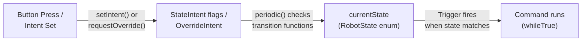

Each state is registered with a Trigger in `init()`:

```java
initState(RobotState.FREE_DRIVE, freeDrive());
initState(RobotState.SHOOTING, startShootingOverride());
initState(RobotState.MANUAL_INTAKE, extendAndIntake());
```

The Trigger continuously checks `() -> this.currentState == state` and runs the associated command while true.

### 2.2 State Enum

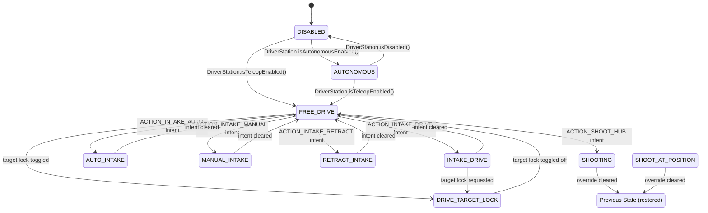

### 2.3 Two Input Mechanisms

The Superstructure has two distinct ways for external code to request state changes:

**1. StateIntent (toggle-based):** Persistent boolean flags that represent driver intentions. Transition functions check these each cycle.

```java
public enum StateIntent {
    ACTION_TOGGLE_TARGET_LOCK_MODE,
    ACTION_INTAKE_MANUAL,
    ACTION_INTAKE_AUTO,
    ACTION_INTAKE_DRIVE,
    ACTION_SHOOT_HUB,
    ACTION_INTAKE_RETRACT,
    ACTION_CLIMB,
    ACTION_NONE;
    
    boolean isIntended;  // each enum value carries its own flag
}
```

**2. OverrideIntent (priority-based):** For actions that must interrupt the current state and restore it afterward (e.g., shooting). Only one override can be active at a time.

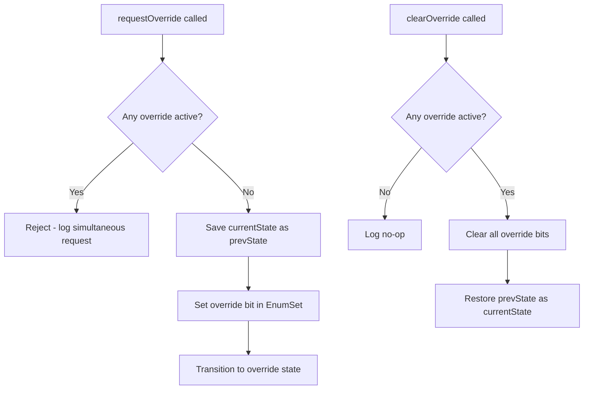

### 2.4 The Periodic Loop

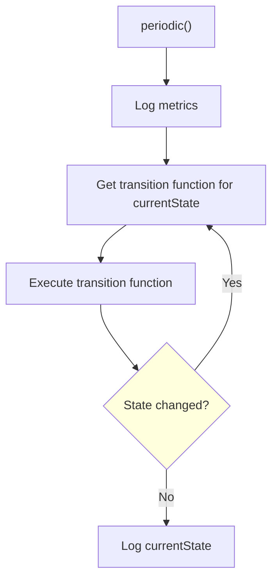

The `do-while` loop re-evaluates transitions until the state stabilizes, allowing multi-hop transitions in a single cycle (e.g., DISABLED -> FREE_DRIVE could theoretically chain further).

### 2.5 State Command Factories

Each state's behavior is defined as a Command factory method:

| State | Command Produced |
|-------|-----------------|
| `DISABLED` | `resetSubsystems()` - halts everything |
| `FREE_DRIVE` | `drivetrain.freeDrive()` - sets drive to TELEOP_DRIVE |
| `DRIVE_TARGET_LOCK` | `drivetrain.targetLock()` + `prepareShooter()` → `startShooting()` |
| `SHOOTING` | `shooter.shoot()` + `hopperFloor.run()` + `indexer.run()` + `drivetrain.targetLock(endless)` |
| `MANUAL_INTAKE` | `intake.setWantedState(EXTEND_AND_RUN)` |
| `INTAKE_DRIVE` | `drivetrain.setState(INTAKE_DRIVE)` + `intake.setWantedState(EXTEND_AND_RUN)` |
| `SHOOT_HOME` | `shooter.shoot()` + `hopperFloor.run()` + `indexer.run()` |

---

## 3. Subsystem Architectures

### 3.1 CommandSwerveDrivetrain

The drivetrain extends CTRE's `TunerSwerveDrivetrain` directly and also implements `Subsystem`. It has its own internal state machine:

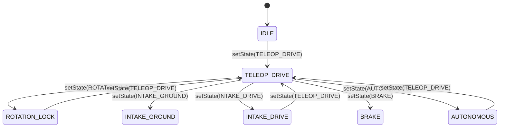

Key features:
- **Skew compensation** with a rotational feedforward based on the robot's stable axis at -45 degrees
- **Limelight vision fusion**: Three Limelights (left, right, back) provide MegaTag2 pose estimates fused via Kalman filter
- **IMU mode management**: Limelights have configurable IMU modes (external seed, internal-only, assist) managed per-cycle
- **Target lock**: Calculates angle-to-hub or angle-to-home and uses `FieldCentricFacingAngle` to maintain heading
- **BLine path following**: Custom path-following system alongside Choreo

### 3.2 Intake

The intake has a full internal state machine (WantedState/SystemState pattern):

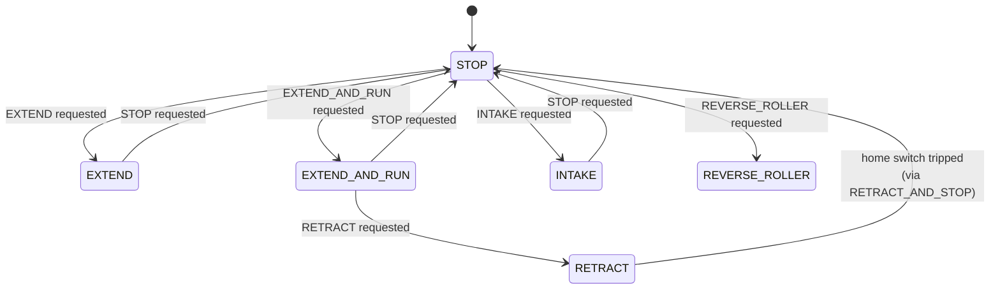

The intake manages both a rack-and-pinion extension mechanism and a roller, coordinating them through state.

### 3.3 Shooter

The shooter does NOT have a periodic state machine. Instead, it exposes imperative methods (`shoot()`, `aim()`, `home()`) and Command factories (`aimAtHub()`, `shootOverrideCommand()`). It uses a **distance-based lookup table** to determine hood angle and flywheel velocity:

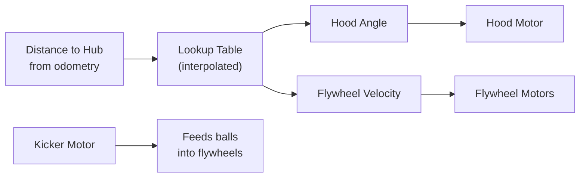

### 3.4 Indexer & HopperFloor

These are simple command-driven subsystems with no internal state machines. They expose `runCommand()` and `halt()` methods. Their behavior is composed externally by the Superstructure or auto routines.

---

## 4. Control Flow: How Inputs Reach Hardware

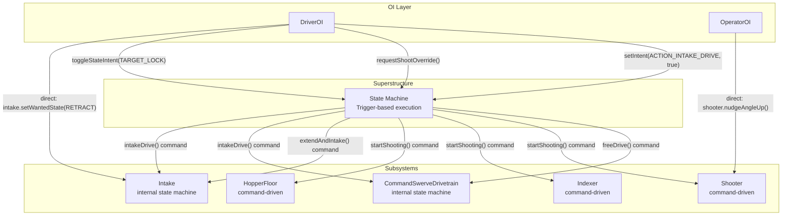

Notable: Some button bindings go through the Superstructure (intents/overrides), while others bypass it entirely and command subsystems directly (e.g., operator nudges, intake retract).

---

## 5. Autonomous

Auto routines are defined in `Autonomous.java` as command sequences registered with a `Choreo.AutoChooser`. The pattern is:

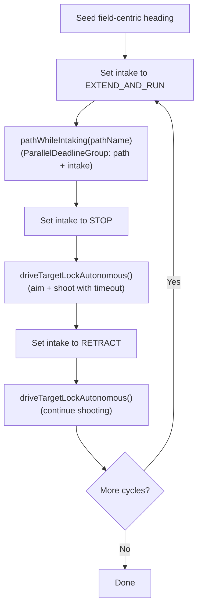

The Superstructure exposes `pathWhileIntaking(pathName)` as a composition helper that runs a BLine path with the intake running in parallel, then stops the intake on completion.

---

## 6. IO Abstraction Layer

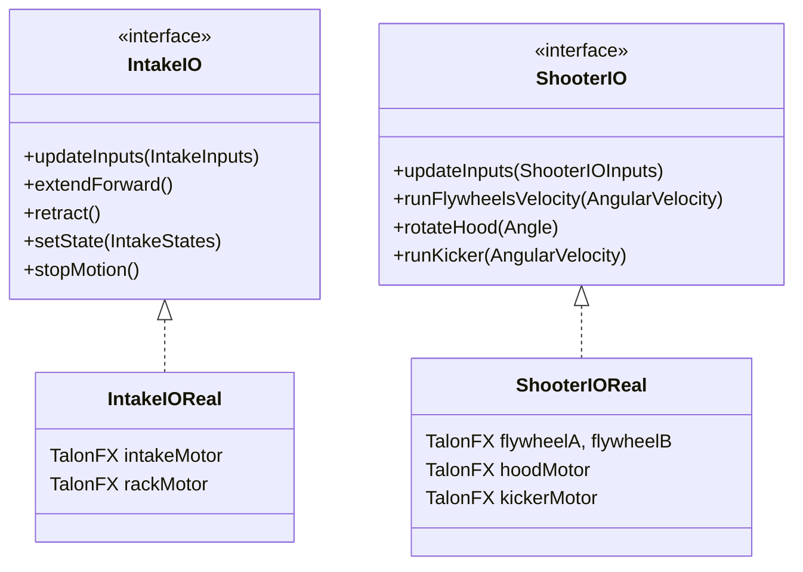

The IO pattern is consistent across subsystems but simpler than some implementations - there are no simulation IO classes present (the `switch (Constants.mode)` defaults to `Real` in all cases).

---

## 7. Vision System

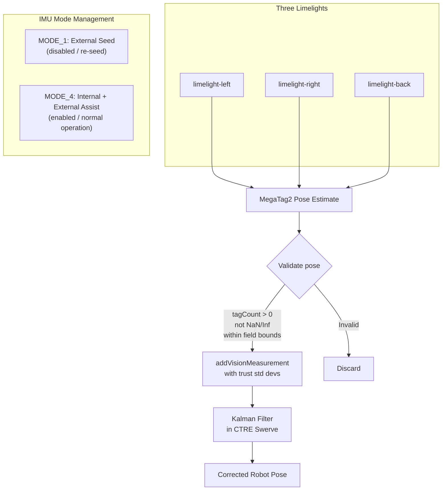

The system transitions Limelight IMU modes based on enabled/disabled state, and seeds rotation from the best available MT1 estimate when in seed mode.

---

## 8. Pros and Cons

### Pros

| Advantage | Explanation |
|-----------|-------------|
| **Trigger-based state execution** | Leverages WPILib's native Trigger/Command infrastructure for state management. Commands get properly scheduled, interrupted, and cleaned up. |
| **Override system with state restoration** | The override pattern (save state → override → restore) provides a clean way to handle temporary interruptions like shooting without losing context. |
| **Separated OI classes** | DriverOI and OperatorOI encapsulate bindings away from the main container, keeping concerns cleanly separated. |
| **Transition function map** | Each state has an explicit transition function, making it clear what exits each state. The `do-while` loop enables multi-hop transitions. |
| **Subsystem autonomy** | Subsystems with internal state machines (intake, drivetrain) can enforce their own safety constraints independently of the Superstructure. |
| **Distance-based shooter lookup** | Interpolated lookup tables for hood angle and velocity provide smooth, tunable shooting across distances. |
| **Vision validation** | Explicit filtering of invalid pose estimates (NaN, Inf, out-of-bounds, no tags) prevents bad data from corrupting odometry. |
| **Comprehensive auto library** | Many auto routines with consistent pick-drive-shoot patterns show a well-developed competition strategy. |

### Cons

| Disadvantage | Explanation |
|--------------|-------------|
| **Split authority over subsystems** | Some commands go through the Superstructure, others bypass it directly (operator nudges, intake retract from DriverOI). This creates ambiguity about who "owns" a subsystem at any given moment. |
| **StateIntent as mutable enum values** | Each enum constant carries its own `isIntended` boolean - this is effectively global mutable state attached to enum constants, which is unusual and could lead to subtle bugs across instances. |
| **Incomplete state coverage** | Several states have TODO/empty implementations (DISABLED handler, some transitions). The `MID_FIELD`, `UNJAM`, and `GET_READY_CLIMB` states exist in the enum but lack full implementation. |
| **Superstructure doesn't own all coordination** | The Superstructure creates commands that require subsystems, but doesn't formally own any subsystems itself (except via `this` for scheduling). This can lead to scheduling conflicts. |
| **No formal pre-conditions on transitions** | Transition functions check if intents are set but don't validate hardware state (e.g., "is the shooter actually ready?" before transitioning to SHOOTING). |
| **Command lifecycle complexity** | Since state changes cause Triggers to start/stop commands, rapid state oscillation could cause commands to be repeatedly created, interrupted, and garbage collected. |
| **Mixed patterns across subsystems** | Drivetrain and Intake have WantedState/SystemState machines, but Shooter, Indexer, and HopperFloor don't. This inconsistency makes it harder to reason about behavior uniformly. |
| **Singleton pattern** | Both RobotContainer and Superstructure are singletons, which makes testing difficult and creates implicit coupling through `getInstance()` calls scattered throughout the code. |
| **Large drivetrain file** | CommandSwerveDrivetrain.java (~1215 lines) handles swerve control, vision fusion, path following, target lock, and multiple drive modes in a single file. |

---

## 9. Notable Design Patterns

### 9.1 The "Intent" Pattern

Rather than buttons directly changing state, they set persistent `isIntended` flags. The state machine reads these flags each cycle and decides whether to transition. This decouples input timing from state execution.

```java
// In DriverOI:
manualIntake.onTrue(mSuperstructure.setIntent(ACTION_INTAKE_DRIVE, true))
            .onFalse(mSuperstructure.setIntent(ACTION_INTAKE_DRIVE, false));

// In Superstructure transition function:
if (StateIntent.ACTION_INTAKE_DRIVE.getIsInteded()) {
    currentState = RobotState.INTAKE_DRIVE;
}
```

### 9.2 The "Override" Pattern

For high-priority temporary actions (shooting), the override system:
1. Saves the current state
2. Transitions to the override state
3. Rejects simultaneous override requests
4. Restores previous state when the override is cleared

This guarantees the robot returns to its prior context after a temporary action.

### 9.3 BLine Path Following

The project includes a custom path-following system (BLine) alongside standard Choreo/PathPlanner, built as a reusable builder pattern:

```java
pathBuilder = new FollowPath.Builder(
    this,                              // subsystem requirement
    this::getCurrentPose2D,            // pose supplier
    this::getCurrentChassisSpeeds,     // speeds supplier
    this::controlRobotDrivetrainAutonomus, // chassis speed consumer
    xController,                       // translation PID
    headingController,                 // rotation PID
    crossTrackController               // lateral correction PID
).withDefaultShouldFlip()
 .withPoseReset(this::resetPose);
```

### 9.4 Shooter Data Collection

A dedicated `ShooterDataCollector` system records shot parameters in real-time, feeds them to a `ShooterLookupTableBuilder`, and enables match replay through `MatchRecorder`. This suggests an iterative calibration workflow where competition data improves the lookup tables.

---

## 10. Summary

2928's architecture sits between a pure command-based approach and a full centralized state machine. The Superstructure manages high-level robot modes and coordinates multi-subsystem actions (like shooting = aim + drive lock + feed), but individual subsystems retain autonomy in how they execute their assigned tasks. The Trigger-based state execution is an interesting hybrid that gets WPILib command lifecycle management "for free" while still maintaining explicit state tracking and logging. The system is designed for a game involving projectile shooting with distance-based aiming, ground intake, and field positioning relative to a hub target.
